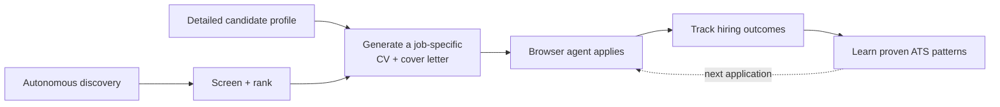

# Hunter

[](https://github.com/lodelux/hunter-public/actions/workflows/ci.yml)
[](LICENSE)

**One detailed profile in; a continuously running job-search loop out.**

Hunter is a fully autonomous personal job-search agent. It discovers and ranks
new roles, generates a genuinely job-specific CV and cover letter from the
candidate profile, completes applications in the browser, tracks later hiring
outcomes, and learns reusable ATS-specific techniques from its own browser runs.

Built as a personal engineering project, Hunter explores how far a long-running
browser agent can go when it has durable state, high-quality source material,
and a controlled way to get better over time.

> **Portfolio snapshot:** this repository is published to show the engineering
> behind Hunter, not as a turnkey product or hosted service. Screenshots use
> synthetic data. Real operation requires model credentials and signed-in job
> board accounts, and may require adaptation as external sites change.


## Why I built it

Most job-search tools automate one task at a time. Hunter connects the entire
loop: discovery, qualification, document generation, browser execution, outcome
tracking, and learning.

The autonomous runner owns schedules, queues, budgets, retries, and durable
state. The profile remains the source of truth while the CV compiler selects and
reframes only the evidence relevant to each role. After a browser run, Hunter can
extract a small set of proven platform techniques and feed them into the next
application on the same ATS. Human attention is reserved for authentication,
CAPTCHAs, or genuinely unclear external outcomes.



## What makes Hunter interesting

### End-to-end autonomy

Once enabled, Hunter runs the search loop itself. It refreshes the existing
qualified queue, discovers and classifies new jobs, enforces fit and daily-cap
policies, prepares application materials, and gives one serialized browser
worker the next eligible role. Schedules, queue membership, attempt state, and
attention gates survive restarts instead of living only in an agent prompt.

See [`backend/autonomy.py`](backend/autonomy.py) and
[`cli/apply_jobs.py`](cli/apply_jobs.py).

### Profile-to-CV generation

The CV pipeline compiles a fresh structured resume from the profile and job
description—not from a generic resume template. It selects the most relevant
evidence, changes emphasis and page allocation for the role, and validates every
profile and job-requirement citation before rendering. PDF QA checks page count,
claims, reading order, links, bounds, extractability, and PDF/A metadata.

Relevant code: [`backend/resume/compiler.py`](backend/resume/compiler.py),
[`backend/resume/tailor.py`](backend/resume/tailor.py), and
[`scripts/cv-eval.py`](scripts/cv-eval.py).

### A browser agent that learns

After a run, Hunter can inspect the browser history for non-obvious recoveries
and successful platform techniques. Only same-platform, evidence-backed lessons
are retained. They are ranked per ATS, constrained by count and token budgets,
and loaded into later applications where they are actually relevant.

See [`backend/memory/`](backend/memory/) and
[`src/pages/Memory.tsx`](src/pages/Memory.tsx).

### Explainable qualification

Listing-derived facts are kept separate from candidate-fit assessment. The UI
shows the score, dimension-by-dimension reasoning, confidence, and supporting
listing evidence. A deterministic policy owns hard rejection rules, and manual
overrides remain explicit.


### Application audit trail

Each attempted application leaves an inspectable dossier with its inputs,
submitted materials, document-generation rationale, structured browser steps,
screenshots, recording metadata, costs, errors, and final outcome.


### Safe ambiguity handling

Application submission is a one-way external action. If the browser disappears,
times out, or lands in an unclear state after submit, Hunter records an
`unknown_outcome` and waits for a human decision. It does not turn uncertainty
into a duplicate application.

Job-level CAPTCHA and authentication blocks are recorded and skipped; unsafe
global states, such as lost LinkedIn authentication or an interrupted
application, pause the runner.

### Closed-loop hiring outcomes

A separate Gmail worker reconciles later outcomes without trusting vague email
similarity. Automatic transitions require explicit outcome wording and an exact
company match; role matching becomes mandatory when multiple applications share
the company. Assessments and ambiguous positive messages alert the user and stay
reviewable. Rejections remain quiet.

See [`backend/gmail_outcomes.py`](backend/gmail_outcomes.py).

## Architecture

Hunter is a local-first web application with a narrow same-origin boundary:

```text
React + TypeScript UI
        │
        ▼
FastAPI API ───── SQLite job store / local application data
   │    │
   │    ├──────── autonomous runner + Gmail outcome worker
   │    └──────── evidence-linked CV / cover-letter compiler
   ▼
Browser Use + Playwright ── job boards and ATS pages
```

| Layer | Technology | Responsibilities |
| --- | --- | --- |
| Product UI | React 19, TypeScript, Vite, Tailwind CSS | Runner control room, job review, evidence, settings, logs |
| API and orchestration | FastAPI, Python 3.13 | Auth, automation, persistence, classification, Gmail, artifacts |
| Browser workflows | Browser Use, Playwright | Collection, login sessions, application forms, visible verification |
| Data | SQLite + local files | Transactional job state, metrics, memories, dossiers, generated documents |
| Document generation | OpenAI-compatible LLMs, RenderCV/Typst, PyMuPDF | Evidence selection, rendering, PDF/A validation, evals |
| Operations | tmux, watchdog, Tailscale Serve | Private hosting, health checks, safe deployment, mobile access |

## What I built on top of LangHire

Hunter started from [LangHire v1.8.8](https://github.com/jaimaann/LangHire/tree/v1.8.8)
and became a substantially different personal system. The main additions include:

- a web-only React/FastAPI architecture and runner-first product design;
- deterministic JobSpy discovery shared by the API and CLI;
- evidence-backed classification and versioned screening policy;
- a persisted autonomous queue with explicit retry and ambiguity semantics;
- an evidence-linked one-page CV compiler with PDF validation and eval tooling;
- application audit dossiers with independent outcome validation;
- conservative Gmail outcome reconciliation and human review queues;
- bounded ATS memory, cost accounting, retention, and operational tooling;
- private same-origin hosting, health telemetry, watchdogs, and safe deployment.

The original LangHire copyright and MIT terms are preserved in
[`THIRD_PARTY_NOTICES.md`](THIRD_PARTY_NOTICES.md).

## Reliability, privacy, and testing

- Runtime data, credentials, browser profiles, generated documents, recordings,
  and dossiers are excluded from Git.
- Browser Use and browser-harness telemetry are disabled in Hunter.
- The backend binds to localhost by default; the private deployment design uses
  authenticated Tailscale Serve rather than a public port.
- Normal tests isolate the application-data directory and mock browsers, model
  calls, Gmail, and network requests.
- The snapshot contains **929 Python tests** and **490 frontend tests**, plus
  TypeScript checking, a production build, dependency audits, and secret scanning
  in CI.

Application dossiers are intentionally sensitive local artifacts: screenshots
and recordings can contain form data, account pages, Gmail, or one-time codes.
The default retention policy removes video after 14 days and complete finished
dossiers after 30 days.

## Repository map

```text
src/                 React application and colocated UI tests
backend/             FastAPI, autonomous runner, classifiers, Gmail, memory
backend/resume/      evidence-linked resume compiler and PDF validation
backend/sources/     JobSpy, LinkedIn browser collection, application plugins
cli/                 collection, application, and memory workflows
tests/               Python backend and CLI tests
evals/cv/            synthetic frozen inputs for CV regression evaluation
scripts/             development, evaluation, deployment, and watchdog tools
```

## Run locally

Requirements: Node.js 20+, Python 3.13+, [uv](https://docs.astral.sh/uv/),
and a Chromium-compatible browser.

```bash
git clone https://github.com/lodelux/hunter-public.git
cd hunter-public
cp profile.example.md profile.md
npm ci
uv sync --frozen
uv run python -m playwright install chromium
npm run dev
```

The launcher starts FastAPI on `127.0.0.1:8743` and Vite on
`http://localhost:1420`, with a fresh local session token behind Vite's
same-origin proxy.

Useful checks:

```bash
npm test
npm run typecheck
npm run build
uv run pytest
```

Live job-board smoke tests, browser applications, Gmail sync, and remote
deployment are deliberately excluded from ordinary CI because they require
accounts or cause external effects.

## License

Copyright (C) 2026 Lorenzo De Luca.

Hunter is released under the [GNU Affero General Public License v3.0](LICENSE).
This choice is compatible with the AGPL terms of the PDF tooling used directly
by the project. PyMuPDF also offers separate commercial licensing; review its
terms for your use case.

Portions derived from LangHire remain copyright 2026 LangHire Contributors and
were provided under the MIT License; see
[`THIRD_PARTY_NOTICES.md`](THIRD_PARTY_NOTICES.md).
