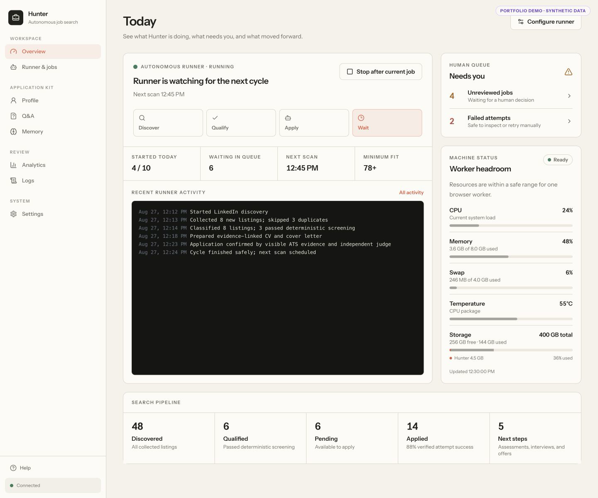
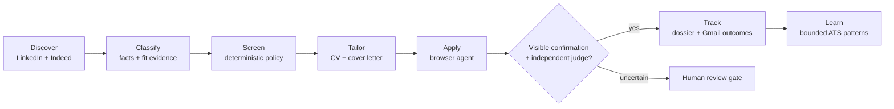
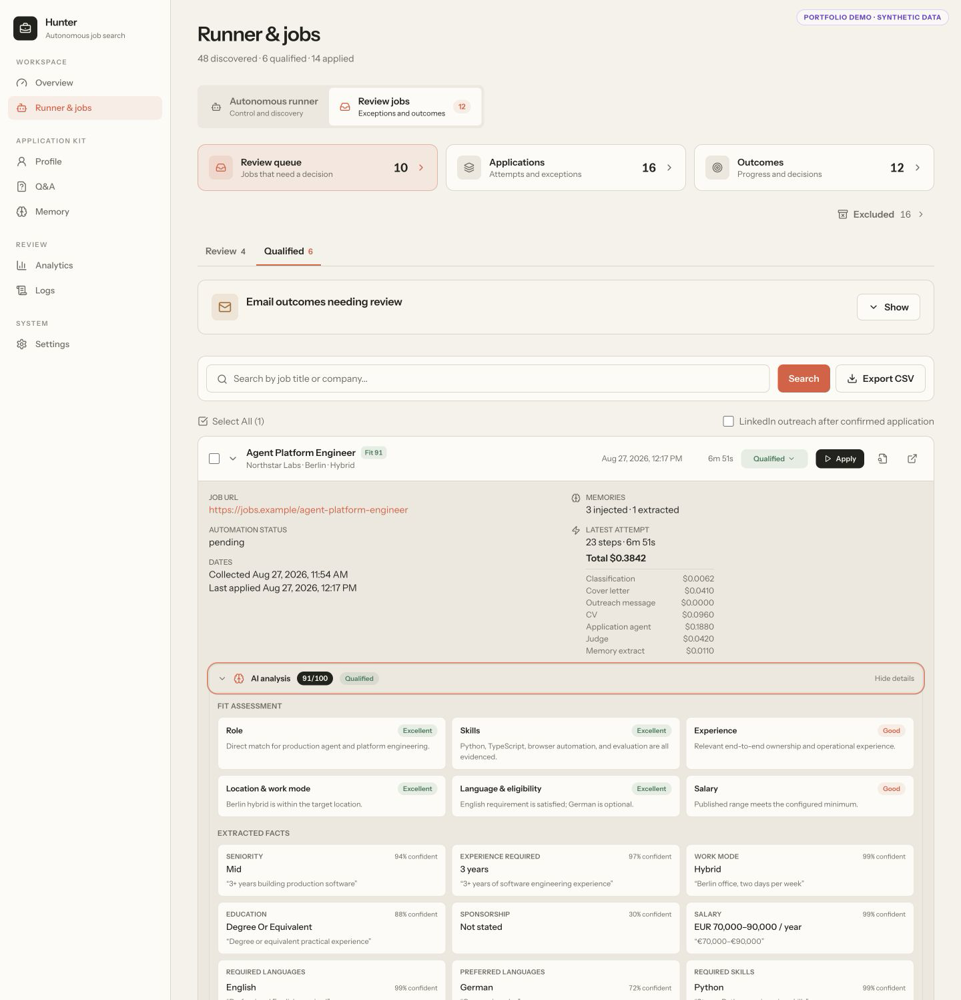
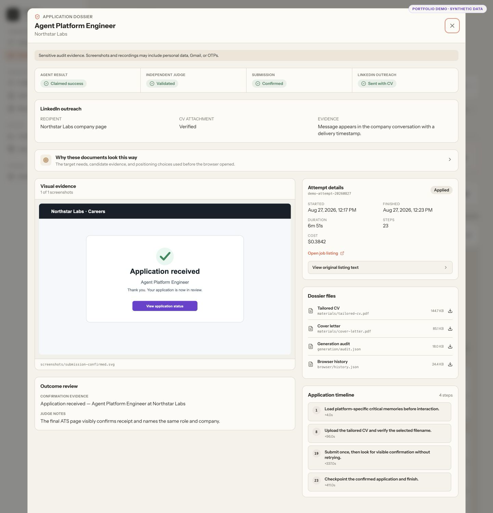

# Hunter

[](https://github.com/lodelux/hunter-public/actions/workflows/ci.yml)
[](LICENSE)

Hunter is a quality-first autonomous job-search system built around evidence,
verification, and human control. It discovers and screens jobs, generates
grounded application materials, operates browser workflows, and refuses to
count an application as successful from an agent claim alone.

Built as a personal engineering project, Hunter explores what production-minded
browser agents look like when “probably succeeded” is not good enough.

> **Portfolio snapshot:** this repository is published to show the engineering
> behind Hunter, not as a turnkey product or hosted service. Screenshots use
> synthetic data. Real operation requires model credentials and signed-in job
> board accounts, and may require adaptation as external sites change.



## Why I built it

Mass auto-apply tools optimize for volume. Hunter tests a different thesis:
fast discovery is useful only when the job is relevant, the application is
genuinely tailored, and the outcome is independently verifiable.

That changes the system design. Classification is explainable. Hard filters are
deterministic. Every generated CV claim traces back to candidate evidence.
Browser runs produce reviewable audit dossiers. Ambiguous post-submit states are
quarantined for review instead of being retried blindly.



## What makes Hunter interesting

### Explainable qualification

Listing-derived facts are kept separate from candidate-fit assessment. The UI
shows the score, dimension-by-dimension reasoning, confidence, and supporting listing
evidence. A deterministic policy owns hard rejection rules, and manual overrides
remain explicit.



### Evidence-linked application materials

The CV pipeline compiles a fresh structured resume from the profile and job
description. Compact requirement and profile citations are validated before
rendering, then expanded into a human-readable generation audit. PDF QA checks
page count, expected claims, reading order, links, bounds, extractability, and
PDF/A metadata; overflow removes complete low-relevance items rather than
truncating prose.

Relevant code: [`backend/resume/compiler.py`](backend/resume/compiler.py),
[`backend/resume/tailor.py`](backend/resume/tailor.py), and
[`scripts/cv-eval.py`](scripts/cv-eval.py).

### Verifiable browser automation

Hunter keeps the two source signals separate: what the browser agent claimed and
what an independent judge concluded. A confirmed outcome requires both, while
the dossier retains the visible ATS evidence for review. Each attempted
application gets a dossier with inputs, submitted materials, structured browser
steps, screenshots, recording metadata, costs, errors, and the
document-generation rationale.



### Safe ambiguity handling

Application submission is a one-way external action. If the browser disappears,
times out, or lands in an unclear state after submit, Hunter records an
`unknown_outcome` and waits for a human decision. It does not turn uncertainty
into a duplicate application.

The autonomous runner is crash-aware, uses one serialized application worker,
and persists state and daily budgets. Job-level CAPTCHA and authentication
blocks are recorded and skipped; unsafe global states, such as lost LinkedIn
authentication or an interrupted application, pause the runner. See
[`backend/autonomy.py`](backend/autonomy.py) and
[`cli/apply_jobs.py`](cli/apply_jobs.py).

### Closed-loop hiring outcomes

A separate Gmail worker reconciles later outcomes without trusting vague email
similarity. Automatic transitions require explicit outcome wording and an exact
company match; role matching becomes mandatory when multiple applications share
the company. Assessments and ambiguous positive messages alert the user and stay
reviewable. Rejections remain quiet.

See [`backend/gmail_outcomes.py`](backend/gmail_outcomes.py).

### Bounded platform memory

Hunter can retain verified, platform-specific recovery patterns from browser
runs. Memories are evidence-gated, ranked per ATS, constrained by count and token
budgets, and treated as untrusted historical observations. Candidate Q&A is kept
out of this learning path.

See [`backend/memory/`](backend/memory/) and
[`src/pages/Memory.tsx`](src/pages/Memory.tsx).

## Architecture

Hunter is a local-first web application with a narrow same-origin boundary:

```text
React + TypeScript UI
        │
        ▼
FastAPI API ───── SQLite job store / local application data
   │    │
   │    ├──────── autonomous runner + Gmail outcome worker
   │    └──────── evidence-linked CV / cover-letter compiler
   ▼
Browser Use + Playwright ── job boards and ATS pages
```

| Layer | Technology | Responsibilities |
| --- | --- | --- |
| Product UI | React 19, TypeScript, Vite, Tailwind CSS | Runner control room, job review, evidence, settings, logs |
| API and orchestration | FastAPI, Python 3.13 | Auth, automation, persistence, classification, Gmail, artifacts |
| Browser workflows | Browser Use, Playwright | Collection, login sessions, application forms, visible verification |
| Data | SQLite + local files | Transactional job state, metrics, memories, dossiers, generated documents |
| Document generation | OpenAI-compatible LLMs, RenderCV/Typst, PyMuPDF | Evidence selection, rendering, PDF/A validation, evals |
| Operations | tmux, watchdog, Tailscale Serve | Private hosting, health checks, safe deployment, mobile access |

## What I built on top of LangHire

Hunter started from [LangHire v1.8.8](https://github.com/jaimaann/LangHire/tree/v1.8.8)
and became a substantially different personal system. The main additions include:

- a web-only React/FastAPI architecture and runner-first product design;
- deterministic JobSpy discovery shared by the API and CLI;
- evidence-backed classification and versioned screening policy;
- a persisted autonomous queue with explicit retry and ambiguity semantics;
- an evidence-linked one-page CV compiler with PDF validation and eval tooling;
- application audit dossiers with independent outcome validation;
- conservative Gmail outcome reconciliation and human review queues;
- bounded ATS memory, cost accounting, retention, and operational tooling;
- private same-origin hosting, health telemetry, watchdogs, and safe deployment.

The original LangHire copyright and MIT terms are preserved in
[`THIRD_PARTY_NOTICES.md`](THIRD_PARTY_NOTICES.md).

## Reliability, privacy, and testing

- Runtime data, credentials, browser profiles, generated documents, recordings,
  and dossiers are excluded from Git.
- Browser Use and browser-harness telemetry are disabled in Hunter.
- The backend binds to localhost by default; the private deployment design uses
  authenticated Tailscale Serve rather than a public port.
- Normal tests isolate the application-data directory and mock browsers, model
  calls, Gmail, and network requests.
- The snapshot contains **929 Python tests** and **490 frontend tests**, plus
  TypeScript checking, a production build, dependency audits, and secret scanning
  in CI.

Application dossiers are intentionally sensitive local artifacts: screenshots
and recordings can contain form data, account pages, Gmail, or one-time codes.
The default retention policy removes video after 14 days and complete finished
dossiers after 30 days.

## Repository map

```text
src/                 React application and colocated UI tests
backend/             FastAPI, autonomous runner, classifiers, Gmail, memory
backend/resume/      evidence-linked resume compiler and PDF validation
backend/sources/     JobSpy, LinkedIn browser collection, application plugins
cli/                 collection, application, and memory workflows
tests/               Python backend and CLI tests
evals/cv/            synthetic frozen inputs for CV regression evaluation
scripts/             development, evaluation, deployment, and watchdog tools
```

## Run locally

Requirements: Node.js 20+, Python 3.13+, [uv](https://docs.astral.sh/uv/),
and a Chromium-compatible browser.

```bash
git clone https://github.com/lodelux/hunter-public.git
cd hunter-public
cp profile.example.md profile.md
npm ci
uv sync --frozen
uv run python -m playwright install chromium
npm run dev
```

The launcher starts FastAPI on `127.0.0.1:8743` and Vite on
`http://localhost:1420`, with a fresh local session token behind Vite's
same-origin proxy.

Useful checks:

```bash
npm test
npm run typecheck
npm run build
uv run pytest
```

Live job-board smoke tests, browser applications, Gmail sync, and remote
deployment are deliberately excluded from ordinary CI because they require
accounts or cause external effects.

## License

Copyright (C) 2026 Lorenzo De Luca.

Hunter is released under the [GNU Affero General Public License v3.0](LICENSE).
This choice is compatible with the AGPL terms of the PDF tooling used directly
by the project. PyMuPDF also offers separate commercial licensing; review its
terms for your use case.

Portions derived from LangHire remain copyright 2026 LangHire Contributors and
were provided under the MIT License; see
[`THIRD_PARTY_NOTICES.md`](THIRD_PARTY_NOTICES.md).
